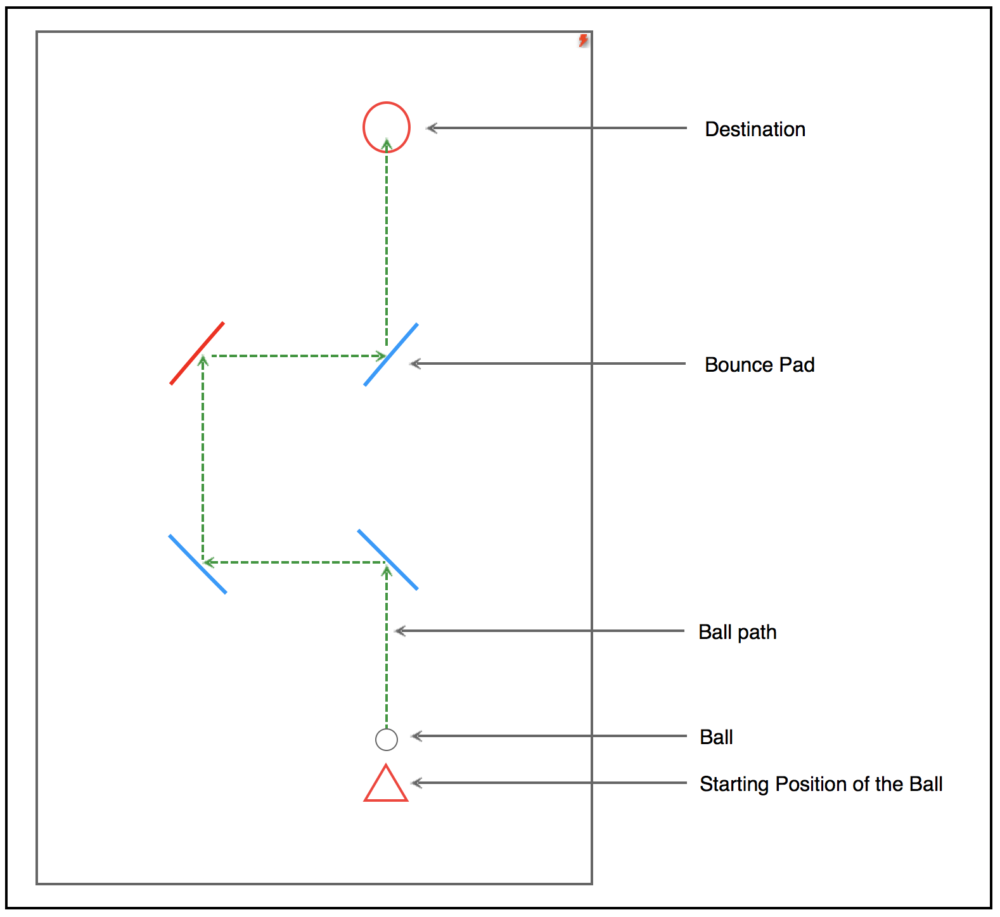

# Bounce
### Background and Overview
Bounce is a puzzle game inspired by a mobile game, logi. In the game, a player needs to send a ball through paddles by rearranging those paddles. There are two different paddles that can deflect the ball, blue and red. Your task is to rearrange the paddles so that the ball can fly to its destination.

The difference between these two pads:
* blue: Regular pad.
* red: It will disappear after it deflects the ball.

### Functionality & MVP
In Bounce, a player will be able to:
* See instructions for the game.
* Rotate the paddle by clicking on it.
* Release the ball by clicking the start icon.
* Select different levels of the game.

### Wireframes

This app will consist of a single screen. The play board will be displayed on the left side, and the instruction for the game will be displayed on the right side.

### Architecture and Technologies
* Vanilla JavaScript for overall structure and game logic.
* `HTML5 Canvas` for rendering.
* CSS for styling.
* `Webpack` to  bundle and serve up the various scripts.

### Implementation Timeline
##### Day 1:
* Set up Node modules, and webpack.
* Create board, paddle, and ball class.

##### Day 2:
* Add clicking event for rotating the bounce pad.
* Implement the logic for ball moving.

##### Day 3:
* Create button for starting game.
* Add more levels.

##### Day 4:
* Finish all the styling.
