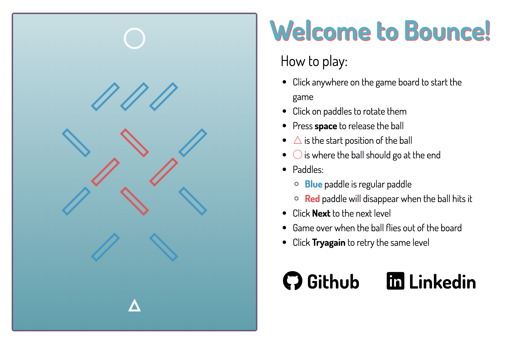

# Bounce
[Bounce Live](https://swei1125.github.io/Bounce/)
### Background and Overview
Bounce is a puzzle game inspired by a mobile game, logi. In the game, a player needs to send a ball through paddles by rearranging those paddles. There are two different paddles that can deflect the ball, blue and red. Your task is to rearrange the paddles so that the ball can fly to its destination.

The difference between these two pads:
* blue: Regular pad.
* red: It will disappear after it deflects the ball.

### Functionality & MVP
In Bounce, a player will be able to:
* See instructions for the game.
* Rotate the paddle by clicking on it.
* Release the ball by pressing the space key.
* Hear the sound effect when the ball hits paddles, gets to destination, and goes out of the board
* Replay the same level if the ball flies out of the board.
* Go to next level if player passes the current level.

#### Highlight Code
To ensure the smoothness of the game, I clear the `setInterval` whenever the ball either flies out of the board or gets to the destination:
``` JavaScript
// lib/game.js
play() {
  const interval = setInterval(() => {
    this.board.draw.bind(this.board)();
    if (this.board.won) { //when the ball gets to destination
      clearInterval(interval);
      if (this.levelNum === Levels.length - 1) {
        this.endQuote.bind(this)();//if it is the last level, render the ending note
      }else {
        this.next = false;
        this.goNext.bind(this)();//render the next button for player to play next level
      }
    }
    if (this.board.over) {   //when the ball flies out
      this.retry = false;
      clearInterval(interval);
      this.finish.bind(this)();//render retry button for player to play again
    }
  }, 13);
}
```

Every time a player click on `tryagain`, the board will re-render the same level and remove all changes that player makes on paddles. I accomplish this by adding the `mousedown` event listener and creating a new board on the canvas. In addition, I also add a `mouseup` event listener to remove the previous `mousedown` event listener, which can prevent re-rendering the board:
``` JavaScript
// lib/game.js
const tryagain = (e) => {
  let x = e.x - this.canvas.offsetLeft;//getting cursor's position
  let y = e.y - this.canvas.offsetTop;
  //check if the cursor position is within the tryagin rectangle
  if (x >= 140 && x <= 360 && y >= 312 && y <= 372) {
    this.retry = true;
    this.ctx.clearRect(0,0, this.canvas.width, this.canvas.height);//clear the canvas
    this.ctx.beginPath();
    this.board = new Board(this.ctx, this.canvas, this.level);
    this.init();//re-render the board
  }
};
const removeMousedown = (e) => {
  let x = e.x - this.canvas.offsetLeft;
  let y = e.y - this.canvas.offsetTop;
  if (x >= 163 && x <= 323 && y >= 312 && y <= 372) {
    this.canvas.removeEventListener("mousedown", tryagain);
  }
};

this.canvas.addEventListener("mousedown", tryagain);
this.canvas.addEventListener("mouseup", removeMousedown);

```

### Wireframes

This app will consist of a single screen. The play board will be displayed on the left side, and the instruction for the game will be displayed on the right side.




### Architecture and Technologies
* Vanilla JavaScript for overall structure and game logic.
* `HTML5 Canvas` for rendering.
* CSS for styling.
* `Webpack` to  bundle and serve up the various scripts.

### Implementation Timeline
##### Day 1:
* Set up Node modules, and webpack.
* Create board, paddle, and ball class.

##### Day 2:
* Add clicking event for rotating the bounce pad.
* Implement the logic for ball moving.

##### Day 3:
* Create button for starting game.
* Add more levels.

##### Day 4:
* Finish all the styling.
